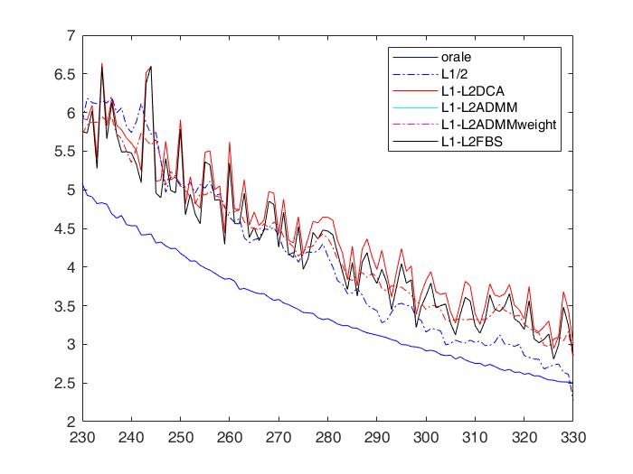

# L1-L2
The code about the paper "Fast l1-l2 minimization via a proximal operator".

The source code is only have the picture which experiment 1. So I plot other two experiments and offer the experiment 1 in Python.

## partical result

# Reference
[source code](https://github.com/mingyan08/ProxL1-L2)
